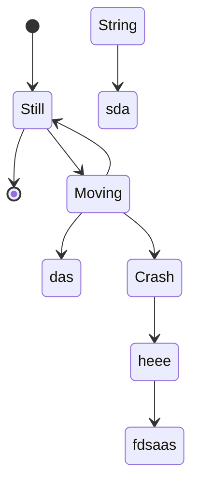
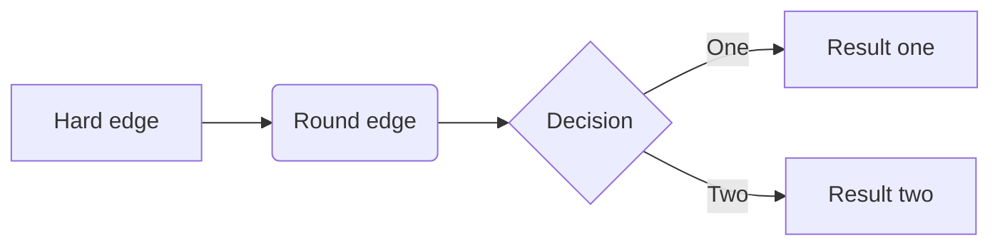
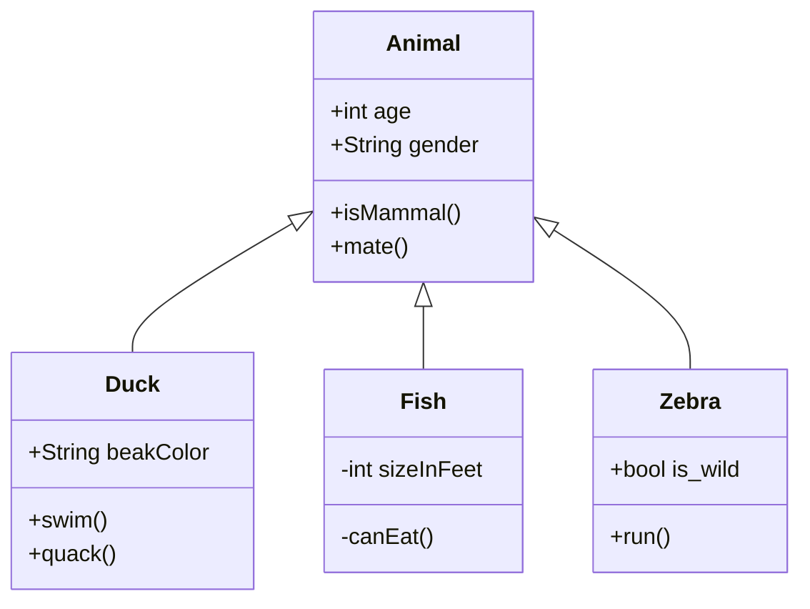
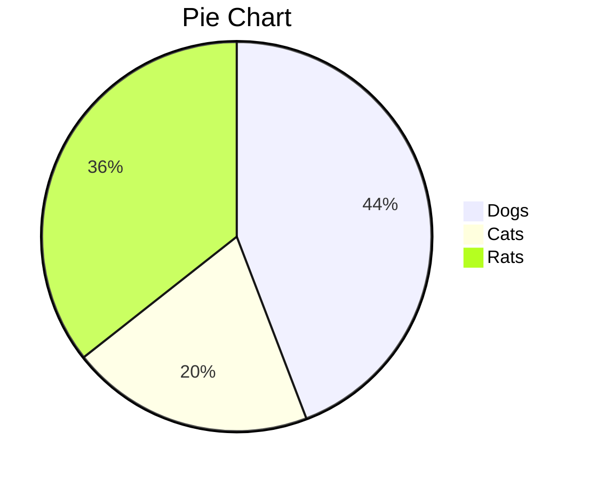

```sequence

Alice->Bob: Hello Bob, how are you?
Note right of Bob: Bob thinks
Note left of Alice: Bob thinks
Bob-->Alice: I am good thanks!

```


```sequence

Title: 标题：复杂使用

对象A->对象B: 对象B你好吗?（请求）

Note right of 对象B: 对象B的描述

Note left of 对象A: 对象A的描述(提示)

对象B-->对象A: 我很好(响应)

对象B->小三: 你好吗

小三-->>对象A: 对象B找我了

对象A->对象B: 你真的好吗？

Note over 小三,对象B: 我们是朋友

participant C

Note right of C: 没人陪我玩
```


```flow
st=>start: Start
op=>operation: Your Operation
cond=>condition: Yes or No?
op2=>operation: Your Operation2
e=>end

st->op->cond
cond(yes)->op2
op2->e
cond(no)->op
```







