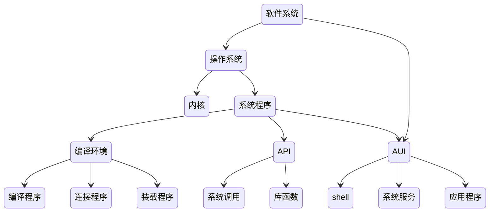

### 第一章 概述

- 在Linux下执行可执行的二进制文件test -- ./test

  执行步骤如下

1. 用户告诉操作系统执行test
2. 操作系统通过文件名在磁盘找到该程序
3. 检查可执行代码的首部，找到代码和数据存放的地址
4. 文件系统找到第一个磁盘块
5. 操作系统建立程序的执行环境
6. 操作系统把程序从磁盘装入内存，并跳到程序开始处执行
7. 操作系统检查字符串的位置是否正确
8. 操作系统查找字符串将被送往的设备
9. 操作系统将字符串送往输出设备的窗口系统确定是一个合法的操作，然后将字符串转化为像素
10. 窗口系统将像素写入存储映像区
11. 硬件将像素转换为一组模拟信号，重画屏幕


- 从操作系统设计者来看，一个操作系统必须包括
  - 操作系统接口;
  - CPU管理
  - 内存管理
  - 设备管理
  - 文件管理
    	




- 操作系统标准  ---  POSIX
  
  - 任何操作系统只要符合POSIX 1003.1 标准就能运行UNIX程序
  
- Linux 内核


  - ```mermaid
    stateDiagram
    进程 --> 内存
    进程 --> 设备
    设备 --> 内存
    进程 --> 文件
    文件 --> 内存
    ```
    
  - Linux要放在整个系统中研究，系统由四个部分组成：


    - 用户进程
    - 系统调用接口
    - Linux内核
    - 硬盘

  - Linux内核除了系统调用外，主要由5个子系统组成


    - 进程调度
    - 内存管理
    - 虚拟文件系统(VFS)
    - 网络接口
    - 进程间通信(IPC，Inter-Progress Communication)